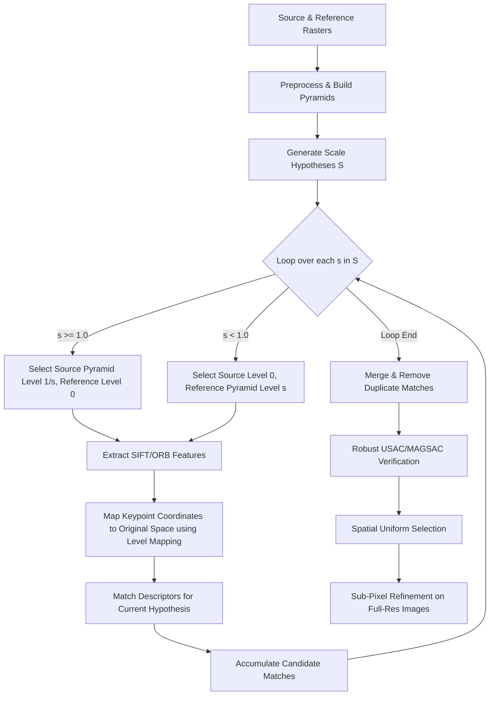

# Scale-Aware Matching Design Proposal (Task 07 Integration)

This document outlines the technical design for integrating the existing scale-aware infrastructure (pyramids, scale-hypothesis generation, and coordinate mappings) into the end-to-end `RegistrationOrchestrator` pipeline.

---

## A. Original Task 07 Intent

As defined in [`TASKLIST.md`](file:///c:/Users/Asus/OneDrive/Desktop/LUNAR%20AI/LUNAR/TASKLIST.md):
* **Task 07 (Descriptor Matching)**: Implement robust descriptor matching with distance metric selection (L2 for float, Hamming for binary), $k$-nearest neighbor (kNN) ratio tests, mutual consistency checks (cross-check), and duplicate correspondence removal.
* **Orchestration Integration**: Although the lower-level matcher was completed, the orchestration pipeline currently runs keypoint detection directly on full-resolution images, bypassing the multi-scale/pyramid search. The intent of this design is to wire the multi-scale features together so that images of highly different spatial resolutions (e.g., TMC-2 at 5.0m vs. OHRC at 0.25m) can be registered successfully.

---

## B. Existing Relevant APIs

The LUNAR codebase already contains the following modular building blocks:

1. **`CoordinateMapping`** ([`src/lunarmatch/geometry/coordinate_mapping.py`](file:///c:/Users/Asus/OneDrive/Desktop/LUNAR%20AI/LUNAR/src/lunarmatch/geometry/coordinate_mapping.py)):
   * Composable $3\times3$ homogeneous transformation matrices.
   * Exposes `apply(points)` and `apply_inverse(points)` to project float coordinates between downsampled levels and the original full-resolution space.
2. **`ImagePyramid` & `PyramidLevel`** ([`src/lunarmatch/features/pyramid.py`](file:///c:/Users/Asus/OneDrive/Desktop/LUNAR%20AI/LUNAR/src/lunarmatch/features/pyramid.py)):
   * `ImagePyramid.build(image, mask, config)` constructs multi-resolution levels using `cv2.resize` (with `INTER_AREA` for downsampling images and `INTER_NEAREST` for masks).
   * Each level contains `scale_factor` (e.g., `0.5`, `0.25`) and `mapping` (maps level coordinates back to original pixel coordinates).
3. **`generate_scale_hypotheses`** ([`src/lunarmatch/features/scale_search.py`](file:///c:/Users/Asus/OneDrive/Desktop/LUNAR%20AI/LUNAR/src/lunarmatch/features/scale_search.py)):
   * Generates a sorted list of scale-ratio hypotheses mapping source to reference.
   * If `metadata_scale_prior` is active and scales are provided, it generates a single hypothesis `reference_scale / source_scale` (plus optional octave offsets).
   * Otherwise, it falls back to a bounded logarithmic scale search list (e.g. `[0.25, 0.5, 1.0, 2.0, 4.0]`).

---

## C. Proposed Architecture

Instead of executing feature matching across all combinations of pyramid levels ($N \times M$ complexity), the orchestrator will leverage the scale hypotheses deterministically to select matching pyramid pairs:

1. **Generate Scale Hypotheses**: Compute the set of target scale ratios $S = \{s_1, s_2, \dots\}$.
2. **Resolution-Matching Pairing Loop**: For each hypothesis $s \in S$:
   * Identify which image has the higher resolution (finer pixel scale). To avoid upsampling artifacts (blurring), we always downsample the higher-resolution image to match the lower-resolution image.
   * **Case 1 ($s \ge 1.0$)**: Source is higher resolution. We search `src_pyr` for the level closest to `1/s` scale factor. Reference is kept at Level 0 (full resolution).
   * **Case 2 ($s < 1.0$)**: Reference is higher resolution. We search `ref_pyr` for the level closest to `s` scale factor. Source is kept at Level 0 (full resolution).
3. **Feature Extraction**: Extract SIFT/ORB features on the chosen source and reference pyramid levels.
4. **Coordinate Restoration**: Apply `lvl.mapping.apply(coords)` to map the detected keypoint pixel coordinates back to the original image spaces.
5. **Descriptor Matching**: Run the existing `DescriptorMatcher` on the extracted descriptors of these resolution-matched levels.
6. **Candidate Merging**: Collect all matches from all scale hypotheses, merge them, and remove duplicates (preserving matches with the highest response or lowest descriptor distance).
7. **Geometric Verification & Downstream Tasks**: Pass the consolidated candidate pool to the existing RANSAC/USAC geometry stage, spatial selector, and sub-pixel refiner.



---

## D. Configuration Changes

To preserve complete backward compatibility, we will add a configuration switch under `pyramid` in [`configs/baseline.yaml`](file:///c:/Users/Asus/OneDrive/Desktop/LUNAR%20AI/LUNAR/configs/baseline.yaml):

```yaml
pyramid:
  scale_aware_matching: false  # Default to false to preserve exact baseline reproducibility
  metadata_scale_prior: true
  log2_scale_min: -4
  log2_scale_max: 4
  levels_per_octave: 2
```

* **`scale_aware_matching = false` (Default)**: Runs SIFT/ORB directly on full-resolution Level 0 of both images (the current baseline).
* **`scale_aware_matching = true`**: Triggers the multi-scale resolution-matching loop.

---

## E. Edge-Case Handling

* **$1.0\times$ Scale Difference**: `s = 1.0`. Pyramids select Level 0 for both images. Matches are identical to the baseline.
* **Severe Scale differences ($20.0\times$)**: If OHRC ($0.25\text{m}$) is matched with TMC-2 ($5.0\text{m}$), $s = 20.0$. The source image is matched at Level $k$ corresponding to scale factor `0.05`. SIFT matches them at similar pixel resolution, and the coordinates are mapped back to original coordinates, enabling RANSAC to succeed.
* **Missing/Invalid Metadata**: Handled. If `metadata_scale_prior = false` or scale fields are missing/NaN, the orchestrator generates logarithmic scale search hypotheses: `[0.25, 0.5, 1.0, 2.0, 4.0]`. RANSAC will naturally select the correct scale based on the inlier count.
* **Very Large Rasters**: Tiling is handled per-level inside the feature backends. Since downsampled levels are smaller, they require less memory and fewer tiles, decreasing OOM risks.

---

## F. Computational Considerations

* **Feature Extraction Cost**: 
  * If metadata priors are used, only **one** scale hypothesis is evaluated. One image is downsampled, which actually *reduces* extraction time and memory compared to the baseline.
  * If doing a blind logarithmic search (5 scales), we extract features on the reference at Level 0, and on the source at 5 different levels. Because the area of downsampled levels decreases exponentially ($1 + 1/4 + 1/16 + 1/64 \approx 1.33$), the total pixel extraction area is only $\approx 33\%$ larger than a single full-resolution extraction.
* **Descriptor Caching**: Extract features on the reference Level 0 once and reuse it across all scale loops.

---

## G. Testing Strategy & Baseline Comparison

We will write a new test suite [`tests/unit/test_scale_aware.py`](file:///c:/Users/Asus/OneDrive/Desktop/LUNAR%20AI/LUNAR/tests/unit/test_scale_aware.py) that:
1. Generates synthetic image pairs with scale differences: $1.0\times$, $1.5\times$, $2.0\times$, $4.0\times$, $10\times$.
2. Verifies that the current baseline (`scale_aware_matching = false`) fails at scales $\ge 4.0\times$.
3. Verifies that the new pipeline (`scale_aware_matching = true`) succeeds across all scales, yielding sub-pixel RMSE ($< 1.0\text{px}$) and high inlier counts.

---

## H. Step-by-Step Implementation Plan

1. **Config Update**: Modify `PyramidConfig` in `src/lunarmatch/models/config.py` to add `scale_aware_matching: bool = False`.
2. **Orchestrator Integration**: Update `RegistrationOrchestrator.register` in `src/lunarmatch/orchestrator.py` at Stage 4 (Feature Extraction) and Stage 5 (Matching) to conditionally execute the multi-scale pairing loop if `scale_aware_matching` is enabled.
3. **Verification**: Run `pytest` to verify that all 133 existing tests pass with default settings.
4. **Integration Testing**: Add `test_scale_aware.py` to test the new configuration on scale-perturbed pairs.

---

### **Modified Files Checklist**:
* [`src/lunarmatch/models/config.py`](file:///c:/Users/Asus/OneDrive/Desktop/LUNAR%20AI/LUNAR/src/lunarmatch/models/config.py) (Add config parameter)
* [`src/lunarmatch/orchestrator.py`](file:///c:/Users/Asus/OneDrive/Desktop/LUNAR%20AI/LUNAR/src/lunarmatch/orchestrator.py) (Integrate the multi-scale loop)
* [`configs/baseline.yaml`](file:///c:/Users/Asus/OneDrive/Desktop/LUNAR%20AI/LUNAR/configs/baseline.yaml) (Add configuration option)
